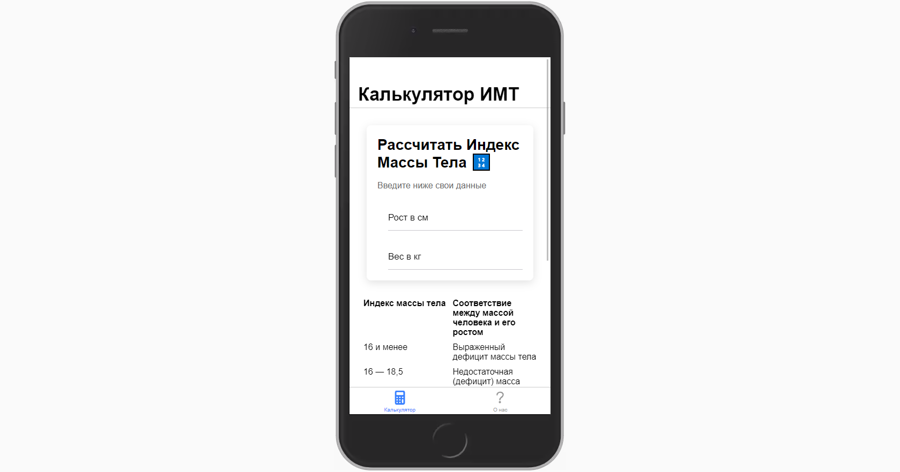

# BMI

Simple Body Mass Index calculator written with vue3



## Setup

### Prerequisites

*   Node.js ([download](https://nodejs.org/en/))
*   and nothing else

### Installation

1.  Clone the repo
```sh
git clone https://github.com/DiSonDS/bmi.git
```
2.  Install node modules
```sh
npm install
```

## Usage

Start app in the browser

```sh
ionic serve
```
